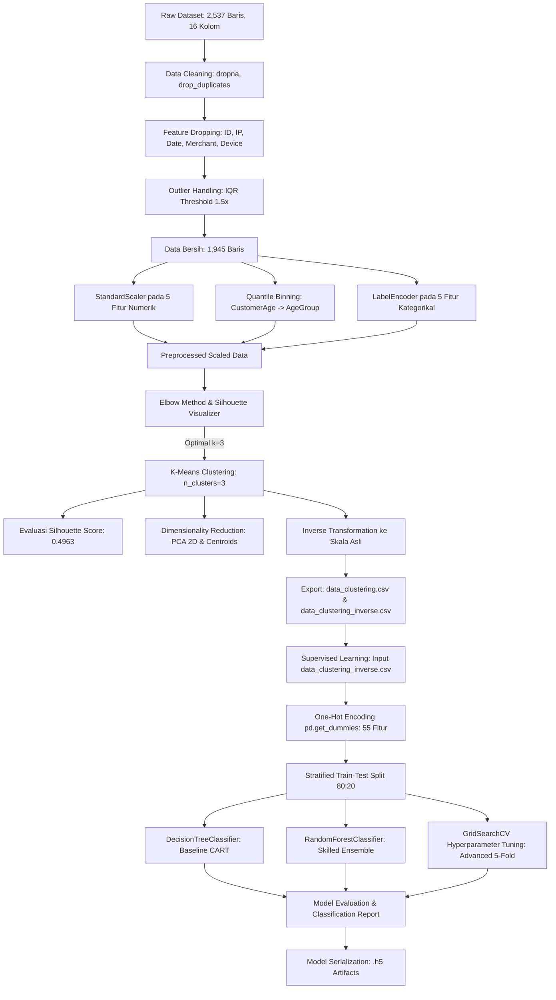

# Financial Fraud Detection & Customer Transaction Profiling Pipeline

[-blue?style=for-the-badge&logo=target&logoColor=white)](https://www.dicoding.com/academies/184)
[](https://www.python.org/)
[](https://scikit-learn.org/)
[](https://pandas.pydata.org/)
[](https://jupyter.org/)
[](https://github.com/G-than12/financial-fraud-detection)
[](https://financial-transaction-profiling.vercel.app/)

> **Proyek Akhir Belajar Machine Learning untuk Pemula (BMLP) — Dicoding Indonesia**  
> Solusi *Machine Learning End-to-End* pada dataset transaksi finansial dan deteksi penipuan (*fraud detection*), mengintegrasikan **Unsupervised Learning** (K-Means Clustering & Reduksi Dimensi PCA 2D) untuk *Customer Behavioral Profiling* dan **Supervised Learning** (Decision Tree & Hyperparameter Tuned Random Forest GridSearchCV) untuk klasifikasi segmen profil nasabah baru dengan akurasi **98.97%**.

---

## 👤 Author Information
- **Nama**: Gathan Hilabi
- **Institusi**: UIN K.H. Abdurrahman Wahid Pekalongan
- **Track**: Machine Learning Engineering & Data Science
- **Program / Kursus**: Belajar Machine Learning untuk Pemula (BMLP) - Dicoding Indonesia
- **Repository URL**: [https://github.com/G-than12/financial-fraud-detection](https://github.com/G-than12/financial-fraud-detection)
- **Interactive Showcase**: [https://financial-transaction-profiling.vercel.app/](https://financial-transaction-profiling.vercel.app/)

---

## 📌 Ruang Lingkup Proyek & Konteks Analitik Perbankan

> [!IMPORTANT]
> **Hubungan Konteks Dataset Fraud Detection & Pipeline Pemodelan:**
> Dataset yang digunakan merupakan **Dataset Transaksi Finansial & Deteksi Penipuan (*Financial Fraud Detection*)** dari Dicoding Indonesia yang merekam jejak transaksi perbankan dan demografi nasabah.
> 
> Sesuai silabus dan instruksi *Submission Akhir BMLP Dicoding*, proyek ini dibangun melalui dua tahapan berkesinambungan:
> 1. **Tahap 1 (Unsupervised Learning)**: Mengelompokkan data transaksi nasabah yang belum berlabel menggunakan algoritma **K-Means Clustering** ($k=3$) dan memvalidasi batas klaster dengan **Silhouette Score** serta **PCA 2D**. Data hasil klaster kemudian di-*inverse transform* ke skala aslinya untuk menyusun interpretasi profil perilaku nasabah (*Customer Behavioral Profiling*). Hasil klaster diekspor dengan kolom target baru (`Target: 0, 1, 2`).
> 2. **Tahap 2 (Supervised Learning)**: Menggunakan data hasil *inverse transform* berserta label `Target` untuk melatih model klasifikasi multi-kelas (**Decision Tree**, **Random Forest**, dan **Tuned Random Forest via GridSearchCV**) sehingga sistem perbankan mampu memprediksi segmen perilaku atau tier risiko transaksi baru secara instan dan *real-time*.
> 
> Di industri perbankan dan fintech modern, pemodelan perilaku dasar (*behavioral baseline*) ini merupakan prasyarat esensial sebelum mendesain sistem deteksi anomali atau aturan pencegahan kecurangan (*fraud prevention rule-engine*).

---

## 🏆 Pemenuhan Kriteria Submission Dicoding BMLP (Kriteria Bintang 5)

Proyek ini telah memenuhi seluruh kriteria kelulusan tingkat **Advanced (Bintang 5)** pada kedua buku kerja (*notebooks*):

### 1. Tahap Clustering (`[Clustering]_Submission_Akhir_BMLP_GathanHilabi.ipynb`)
| Tingkatan Kriteria | Syarat Kriteria Dicoding | Status Implementasi dalam Proyek |
| :--- | :--- | :---: |
| **Basic** | Memuat dataset, analisis data deskriptif dasar, pembersihan *missing value* & duplikasi, standardisasi fitur, pemodelan K-Means (Elbow Method), dan ekspor file CSV. |  **Terpenuhi** |
| **Skilled** | Visualisasi matriks korelasi fitur numerik & visualisasi distribusi tanpa *overlap*, penanganan *outlier* dengan metode **IQR (Interquartile Range)**, penentuan jumlah klaster optimal dengan metrik **Silhouette Score** (`KElbowVisualizer`), serta interpretasi klaster sebelum *inverse* (*kondisi scaled*). |  **Terpenuhi** |
| **Advanced** | Rekayasa fitur (*Feature Engineering*) umur nasabah (`CustomerAge`) menjadi kategori usia (`AgeGroup`) dengan *quantile binning*, reduksi dimensi **PCA (2 Komponen)** untuk visualisasi sebaran klaster dan koordinat *centroid*, serta interpretasi komprehensif setelah *inverse transform* ke nilai riil (mean, min, max, modus). |  **Terpenuhi** |

### 2. Tahap Klasifikasi (`[Klasifikasi]_Submission_Akhir_BMLP_GathanHilabi.ipynb`)
| Tingkatan Kriteria | Syarat Kriteria Dicoding | Status Implementasi dalam Proyek |
| :--- | :--- | :---: |
| **Basic** | Memuat dataset hasil klasterisasi, *train-test split*, membangun model **Decision Tree Classifier**, evaluasi performa (*Classification Report* & Akurasi), dan serialisasi model (`decision_tree_model.h5`). |  **Terpenuhi** |
| **Skilled** | Membangun model klasifikasi kedua berbasis ensemble (**Random Forest Classifier**), perbandingan performa antar model dasar. |  **Terpenuhi** |
| **Advanced** | Optimasi hiperparameter model klasifikasi menggunakan **GridSearchCV** dengan *5-Fold Stratified Cross-Validation*, evaluasi model terbaik (Akurasi Uji: **98.97%**, Macro F1: **0.99**), dan serialisasi model hasil tuning (`tuning_classification.h5`). |  **Terpenuhi** |

---

## 📋 Table of Contents
1. [Project Overview](#-project-overview)
2. [Project Objectives](#-project-objectives)
3. [Dataset & Feature Architecture](#-dataset--feature-architecture)
4. [Machine Learning Pipeline](#-machine-learning-pipeline)
5. [Unsupervised Learning: K-Means Clustering](#-unsupervised-learning-k-means-clustering)
6. [Supervised Learning: Segment Classification](#-supervised-learning-segment-classification)
7. [Model Comparison & Benchmark Results](#-model-comparison--benchmark-results)
8. [Business Impact & Strategic Recommendations](#-business-impact--strategic-recommendations)
9. [Repository Structure & Model Artifacts](#-repository-structure--model-artifacts)
10. [Interactive Project Showcase Website](#-interactive-project-showcase-website)
11. [Installation & Quick Start](#-installation--quick-start)
12. [Lisensi & Atribusi](#-lisensi--atribusi)

---

## 🔍 Project Overview

Institusi finansial modern mengelola jutaan transaksi setiap hari dari nasabah dengan latar belakang yang sangat heterogen—mulai dari pelajar/mahasiswa berpendapatan terbatas hingga profesional mapan dengan volume transaksi dan saldo tinggi. Pendekatan analitik seragam (*one-size-fits-all*) tidak memadai untuk mitigasi risiko, pencegahan penipuan (*fraud prevention*), maupun personalisasi layanan.

Proyek ini menghadirkan arsitektur *machine learning end-to-end* yang memadukan keunggulan **Unsupervised Learning** dan **Supervised Learning**:
1. **Unsupervised Discovery**: Menemukan pola tersembunyi dari aktivitas transaksi menggunakan algoritma **K-Means Clustering**. Jumlah klaster optimal ditentukan secara objektif pada $k=3$ dengan **Silhouette Score** mencapai **0.4963**, divisualisasikan menggunakan **PCA 2D**, dan diinterpretasikan kembali ke skala riil perbankan.
2. **Supervised Automated Inference**: Mentransformasikan hasil klasterisasi menjadi label kelas terawasi (`Target: 0, 1, 2`) untuk melatih model klasifikasi (**Decision Tree** dan **Random Forest**). Melalui teknik pencarian hiperparameter mendalam (**GridSearchCV 5-Fold Cross-Validation**), model mencapai akurasi uji hingga **98.97%**, memungkinkan inferensi segmen transaksi baru secara instan dalam hitungan milidetik (*sub-millisecond*).
3. **Interactive Showcase Deployment**: Menyertakan aplikasi web interaktif berbasis React + Vite + Tailwind CSS untuk memvisualisasikan proyeksi PCA, matriks konfusi dinamis, kamus fitur, dan artefak model yang dapat diakses secara publik.

---

## 🎯 Project Objectives

- [x] **Pembersihan & Pra-Pemrosesan Data**: Mengeliminasi *missing values* (18–30 per fitur), membersihkan duplikasi baris (21 baris duplikat), serta menghapus kolom identifier berdimensi tinggi/temporal (*TransactionID*, *AccountID*, *Date*, *IP Address*, *DeviceID*, *MerchantID*, *PreviousTransactionDate*).
- [x] **Deteksi & Penanganan Outlier**: Menapis pencilan data numerik menggunakan metode **Interquartile Range (IQR)** dengan batas $1.5 \times IQR$ untuk menghasilkan data bersih berukuran 1.945 baris.
- [x] **Feature Engineering & Scaling**: Mengimplementasikan *quantile-based binning* pada fitur umur (`CustomerAge`) menjadi 3 kategori (`AgeGroup`: Rendah, Sedang, Tinggi) dan standardisasi fitur numerik menggunakan `StandardScaler`.
- [x] **Pemodelan K-Means Clustering**: Menentukan jumlah klaster optimal ($k=3$) berbasis *Silhouette Score Elbow Visualizer* dan melatih model K-Means berkinerja tinggi (*Silhouette Score*: **0.4963**).
- [x] **Reduksi Dimensi & Visualisasi 2D**: Menerapkan algoritma **PCA (n_components=2)** untuk visualisasi sebaran klaster dan penentuan letak koordinat *centroid*.
- [x] **Inverse Transform & Interpretasi Bisnis**: Mengembalikan data hasil klasterisasi ke skala asli (rupiah/dolar dan kategori teks) untuk memetakan karakteristik statistik (mean, min, max, modus) tiap segmen nasabah.
- [x] **Pembangunan Model Klasifikasi Multi-Kelas**: Melatih *Decision Tree Classifier* (baseline) dan *Random Forest Classifier* (advanced ensemble).
- [x] **Hyperparameter Tuning via GridSearchCV**: Menemukan kombinasi parameter terbaik pada Random Forest (`n_estimators`, `max_depth`, `min_samples_split`) dengan 5-fold cross-validation.
- [x] **Evaluasi Komprehensif**: Mengevaluasi model menggunakan metrik *Accuracy*, *Precision*, *Recall*, dan *F1-Score* berbasis *confusion report*, mencapai akurasi uji hingga **98.97%**.
- [x] **Serialisasi & Penyimpanan Model**: Menyimpan seluruh artefak model ke dalam format HDF5/Joblib (`.h5`) yang siap untuk *deployment* inferensi.

---

## 📊 Dataset & Feature Architecture

Dataset mencatat aktivitas transaksi perbankan dan demografi nasabah dari Google Sheets Enterprise CSV Dicoding:

| Metadata Atribut | Deskripsi / Nilai Riil |
| :--- | :--- |
| **Sumber Data** | Google Sheets Enterprise CSV Endpoint (Dicoding BMLP) |
| **Ukuran Data Mentah** | 2.537 Baris $\times$ 16 Kolom |
| **Ukuran Data Bersih (Preprocessed)** | 1.945 Baris $\times$ 11 Kolom (Termasuk kolom `Target`) |
| **Target Prediksi (Kelas Supervised)** | `Target` (Nilai klaster: 0, 1, 2) |
| **Fitur Numerik** | 5 Fitur (`TransactionAmount`, `CustomerAge`, `TransactionDuration`, `LoginAttempts`, `AccountBalance`) |
| **Fitur Kategorikal** | 5 Fitur (`TransactionType`, `Location`, `Channel`, `CustomerOccupation`, `AgeGroup`) |
| **Fitur Hasil One-Hot Encoding** | 55 Fitur (Digunakan pada tahap klasifikasi) |

### Kamus Data (Feature Dictionary)

| Nama Fitur | Tipe Data | Kategori | Deskripsi Bisnis |
| :--- | :---: | :---: | :--- |
| **TransactionAmount** | Float | Numerik | Besaran nilai uang yang ditransaksikan dalam satu transaksi. |
| **CustomerAge** | Float | Numerik | Usia nasabah pemilik rekening (rentang: 18 – 80 tahun). |
| **TransactionDuration** | Float | Numerik | Durasi waktu penyelesaian sesi transaksi (satuan detik: 10 – 300 detik). |
| **LoginAttempts** | Float | Numerik | Jumlah percobaan login nasabah sebelum transaksi diproses (stabil di angka 1.0). |
| **AccountBalance** | Float | Numerik | Total saldo simpanan nasabah di rekening bank. |
| **TransactionType** | Object | Kategorikal | Metode otorisasi transaksi yang digunakan nasabah (`Debit` / `Credit`). |
| **Location** | Object | Kategorikal | Kota asal transaksi/nasabah (misal: *Charlotte*, *Tucson*, *Fort Worth*, dsb.). |
| **Channel** | Object | Kategorikal | Kanal layanan perbankan yang digunakan (`Branch`, `ATM`, `Online`). |
| **CustomerOccupation** | Object | Kategorikal | Profesi nasabah (`Student`, `Doctor`, `Engineer`, `Retired`). |
| **AgeGroup** | Object | Rekayasa (*Engineered*) | Fitur hasil *quantile binning* umur nasabah (`Rendah`, `Sedang`, `Tinggi`). |
| **Target** | Integer | Label Kelas | Label klaster hasil Unsupervised K-Means (`0`, `1`, `2`). |

> *Catatan Eliminasi Fitur: Kolom `TransactionID`, `AccountID`, `PreviousTransactionDate`, `DeviceID`, `IP Address`, `MerchantID`, dan `TransactionDate` telah dieliminasi pada tahap data cleaning karena bertindak sebagai identifier ber-cardinalitas tinggi yang tidak memiliki signifikansi generalisasi statistik.*

---

## ⚙️ Machine Learning Pipeline

### Pipeline Flowchart



### Architectural Text Pipeline
```
[RAW DATA: 2,537 baris x 16 kolom]
   │
   ├─► [CLEANING] dropna() ──► drop_duplicates() (21 baris) ──► drop(id, ip, date, etc.)
   │
   ├─► [OUTLIER TRIMMING] IQR Filtering (1.5x IQR) ──► Data Bersih: 1,945 baris
   │
   ├─► [FEATURE ENG] Quantile Binning: CustomerAge ──► AgeGroup (Rendah, Sedang, Tinggi)
   │
   ├─► [TRANSFORMATION] StandardScaler(Numerik) + LabelEncoder(Kategorikal)
   │
   ├─► [UNSUPERVISED] K-Means (k=3, Silhouette=0.4963) + PCA 2D
   │        │
   │        ├─► Simpan Model: model_clustering.h5 & PCA_model_clustering.h5
   │        └─► Inverse Transform ──► data_clustering_inverse.csv (Target: 0, 1, 2)
   │
   └─► [SUPERVISED] One-Hot Encoding (55 fitur) ──► Stratified Split (80:20)
            │
            ├─► Model 1: Decision Tree (Akurasi: 95.63%) ──► decision_tree_model.h5
            ├─► Model 2: Random Forest (Akurasi: 98.71%) ──► explore_RandomForest_classification.h5
            └─► Model 3: Tuned Random Forest (Akurasi: 98.97%) ──► tuning_classification.h5
```

---

## 🔬 Unsupervised Learning: K-Means Clustering

### 1. Penentuan Jumlah Klaster Optimal ($k$)
Jumlah klaster ditentukan menggunakan **KElbowVisualizer** dengan rentang $k \in [2, 9]$. Berdasarkan kurva *Silhouette Coefficient*, penurunan inersia paling stabil dan kohesi klaster terbaik diperoleh pada titik **$k = 3$**.

- **Algoritma**: K-Means (`n_clusters=3`, `random_state=42`)
- **Silhouette Score**: **0.49634** (~0.50), menandakan pemisahan antar klaster sangat tegas dengan tingkat tumpang-tindih (*overlap*) yang sangat minimal.
- **Reduksi Dimensi**: PCA 2 Komponen (`PCA(n_components=2)`) digunakan untuk memetakan koordinat titik transaksi serta memvisualisasikan titik pusat (*centroid*) klaster pada bidang kartesius 2 dimensi.

### 2. Statistik Agregasi Data Hasil Inverse Transform

Data dikembalikan ke nilai riil menggunakan `scaler.inverse_transform` (fitur numerik) dan pemetaan kategori asli untuk interpretasi bisnis:

#### Ringkasan Statistik Fitur Numerik (Mean, Min, Max)
| Fitur Numerik | Metrik | Cluster 0 (555 data) | Cluster 1 (690 data) | Cluster 2 (700 data) |
| :--- | :--- | :---: | :---: | :---: |
| **TransactionAmount** | Mean<br>Min<br>Max | **254.56**<br>0.32<br>903.19 | **258.21**<br>0.26<br>889.01 | **257.29**<br>0.45<br>890.24 |
| **CustomerAge** (Tahun) | Mean<br>Min<br>Max | **44.84**<br>18.00<br>80.00 | **43.85**<br>18.00<br>80.00 | **45.41**<br>18.00<br>80.00 |
| **TransactionDuration** (Detik) | Mean<br>Min<br>Max | **119.74**<br>10.00<br>300.00 | **117.31**<br>10.00<br>299.00 | **120.70**<br>10.00<br>299.00 |
| **LoginAttempts** (Kali) | Mean<br>Min<br>Max | **1.00**<br>1.00<br>1.00 | **1.00**<br>1.00<br>1.00 | **1.00**<br>1.00<br>1.00 |
| **AccountBalance** | Mean<br>Min<br>Max | **5,001.21**<br>117.98<br>14,935.50 | **5,109.80**<br>102.20<br>14,977.99 | **5,170.92**<br>112.76<br>14,942.78 |

#### Ringkasan Karakteristik Fitur Kategorikal (Modus)
| Fitur Kategorikal | Cluster 0 | Cluster 1 | Cluster 2 |
| :--- | :---: | :---: | :---: |
| **CustomerOccupation** | Student (Pelajar/Mahasiswa) | Student (Pelajar/Mahasiswa) | Engineer (Insinyur/Profesional) |
| **AgeGroup** | Rendah | Rendah | Sedang (Produktif Matang) |
| **TransactionType** | Debit | Debit | Debit |
| **Location** | Charlotte | Tucson | Fort Worth |
| **Channel** | Branch | Branch | Branch |

### 3. Profiling Karakteristik Segmen Nasabah
1. **Cluster 0: Nasabah Mahasiswa/Pelajar dengan Transaksi Harian Standar (Low Balance Tier)**
   - Rata-rata saldo terendah (**5.001,21**) dengan proporsi dominan pelajar/mahasiswa (*Student*) pada kelompok usia muda (*Rendah*). Transaksi cenderung bertipe debit di kantor cabang fisik.
2. **Cluster 1: Nasabah Muda Aktif & Transaksi Cepat (High Velocity Shoppers)**
   - Rata-rata usia termuda (**43,85 tahun**) dengan nominal rata-rata transaksi tertinggi (**258,21**) dan durasi penyelesaian sesi tercepat (**117,31 detik**). Menunjukkan segmen nasabah aktif dengan mobilitas transaksi tinggi.
3. **Cluster 2: Nasabah Profesional Mapan (Affluent Tier)**
   - Akumulasi saldo simpanan tertinggi (**5.170,92**) dan usia paling matang (**45,41 tahun**). Didominasi profesi insinyur (*Engineer*) pada kelompok usia produktif menengah (*Sedang*). Menjadi target utama untuk produk investasi dan *wealth management*.

---

## 🤖 Supervised Learning: Segment Classification

### Data Splitting & Feature Encoding
- **Data Input**: `data/data_clustering_inverse.csv`
- **Encoding**: `pd.get_dummies(..., drop_first=True)` menghasilkan **55 fitur**.
- **Proporsi Split**: 80% Data Latih (1.556 sampel) dan 20% Data Uji (389 sampel).
- **Stratifikasi**: `stratify=y` menjamin distribusi ketiga kelas klaster seimbang pada data latih dan uji.

---

## 📈 Model Comparison & Benchmark Results

Evaluasi performa dilakukan pada data uji independen (*389 sampel*) menggunakan metrik standar industri:

### 1. Performa Decision Tree Classifier (Baseline — Basic)
- Parameter: `DecisionTreeClassifier(random_state=42)`
- Akurasi Keseluruhan: **95.63% (0.96)**

| Kelas Target | Precision | Recall | F1-Score | Support |
| :---: | :---: | :---: | :---: | :---: |
| **Cluster 0** | 0.91 | 0.95 | 0.93 | 111 |
| **Cluster 1** | 1.00 | 1.00 | 1.00 | 138 |
| **Cluster 2** | 0.96 | 0.92 | 0.94 | 140 |
| **Accuracy** | | | **0.96** | **389** |
| **Macro Avg** | **0.95** | **0.96** | **0.95** | 389 |
| **Weighted Avg** | **0.96** | **0.96** | **0.96** | 389 |

### 2. Performa Random Forest Classifier (Skilled Exploration)
- Parameter: `RandomForestClassifier(random_state=42)`
- Akurasi Keseluruhan: **98.71% (0.99)**

| Kelas Target | Precision | Recall | F1-Score | Support |
| :---: | :---: | :---: | :---: | :---: |
| **Cluster 0** | 1.00 | 0.95 | 0.98 | 111 |
| **Cluster 1** | 1.00 | 1.00 | 1.00 | 138 |
| **Cluster 2** | 0.97 | 1.00 | 0.98 | 140 |
| **Accuracy** | | | **0.99** | **389** |
| **Macro Avg** | **0.99** | **0.98** | **0.99** | 389 |
| **Weighted Avg** | **0.99** | **0.99** | **0.99** | 389 |

### 3. Performa Tuned Random Forest via GridSearchCV (Advanced Optimization)
- Metode Tuning: `GridSearchCV(cv=5, scoring='accuracy')`
- Parameter Grid yang Diuji:
  ```python
  params = {
      'n_estimators': [50, 100, 200],
      'max_depth': [None, 10, 20],
      'min_samples_split': [2, 5]
  }
  ```
- **Best Hyperparameters**: `{'max_depth': None, 'min_samples_split': 2, 'n_estimators': 50}`
- **Best CV Score**: **98.65%**
- **Akurasi Data Uji**: **98.97% (0.99)**

| Kelas Target | Precision | Recall | F1-Score | Support |
| :---: | :---: | :---: | :---: | :---: |
| **Cluster 0** | 1.00 | 0.95 | 0.98 | 111 |
| **Cluster 1** | 0.99 | 1.00 | 1.00 | 138 |
| **Cluster 2** | 0.97 | 1.00 | 0.99 | 140 |
| **Accuracy** | | | **0.99** | **389** |
| **Macro Avg** | **0.99** | **0.98** | **0.99** | 389 |
| **Weighted Avg** | **0.99** | **0.99** | **0.99** | 389 |

### Tabel Komparasi Model

| Model | Tingkatan Kriteria | Accuracy | Macro F1 | Weighted F1 | Ukuran Artefak | Status Model |
| :--- | :--- | :---: | :---: | :---: | :---: | :---: |
| **Decision Tree** | Basic (Baseline) | 95.63% | 0.95 | 0.96 | ~16 KB | Terverifikasi |
| **Random Forest** | Skilled (Ensemble) | 98.71% | 0.99 | 0.99 | ~1.8 MB | Terverifikasi |
| **Tuned Random Forest** | Advanced (GridSearchCV) | **98.97%** | **0.99** | **0.99** | ~914 KB | **Model Terbaik (Champion)** |

---

## 💼 Business Impact & Strategic Recommendations

Implementasi pipeline ini memberikan nilai strategis bagi keamanan transaksi dan operasional perbankan digital:

1. **Pondasi Deteksi Anomali & Fraud Prevention Baseline**:
   - Dengan terpetakannya parameter transaksi normal pada setiap klaster (seperti batas nominal, durasi sesi, dan saldo), setiap transaksi masuk yang menyimpang drastis dari batas klaster nasabah bersangkutan dapat langsung dipicu sebagai sinyal risiko (*anomaly risk trigger*) untuk verifikasi OTP tambahan atau penahanan sementara (*freeze*).
2. **Segment-Driven Product Offering**:
   - **Cluster 0 (Pelajar/Low Balance)**: Program bebas biaya administrasi bulanan, promo merchant kuliner/pendidikan, serta edukasi migrasi transaksi cabang ke *mobile banking*.
   - **Cluster 1 (High Velocity Shoppers)**: Program *cashback* transaksi cepat, integrasi *contactless debit/e-wallet*, dan fasilitas tabungan terencana otomatis (*auto-debit*).
   - **Cluster 2 (Affluent Professionals)**: Penawaran produk *wealth management*, reksa dana, deposito premium, serta kartu kredit prioritas.
3. **Automated Real-Time Segmentation**:
   - Model klasifikasi yang telah dituning mampu mengklasifikasikan nasabah baru secara *sub-millisecond* saat transaksi pertama kali terjadi, memungkinkan *personalized UI/UX* dan mitigasi risiko instan.

---

## 📂 Repository Structure & Model Artifacts

```
financial-fraud-detection/
├── data/
│   ├── data_clustering.csv                 # Dataset hasil clustering (skala terstandardisasi)
│   └── data_clustering_inverse.csv         # Dataset hasil clustering (skala riil + label Target)
│
├── models/
│   ├── model_clustering.h5                 # Model K-Means Clustering (n_clusters=3)
│   ├── PCA_model_clustering.h5             # Model K-Means hasil reduksi dimensi PCA 2D
│   ├── decision_tree_model.h5              # Model Decision Tree Classifier (Akurasi: 95.63%)
│   ├── explore_RandomForest_classification.h5 # Model Random Forest Classifier (Akurasi: 98.71%)
│   └── tuning_classification.h5            # Model Random Forest Tuned GridSearchCV (Akurasi: 98.97%)
│
├── notebooks/
│   ├── [Clustering]_Submission_Akhir_BMLP_GathanHilabi.ipynb   # Pipeline Clustering & Preprocessing (Bintang 5)
│   └── [Klasifikasi]_Submission_Akhir_BMLP_GathanHilabi.ipynb  # Pipeline Klasifikasi & Tuning (Bintang 5)
│
├── website/                                # 🌐 Interactive Project Showcase Website (React + Vite + Tailwind CSS)
│   ├── src/
│   │   ├── components/                     # 13 Modular UI Showcase Components
│   │   ├── data/projectData.ts             # 100% Verified Metrics, Centroids, & PCA Data
│   │   ├── App.tsx
│   │   └── main.tsx
│   ├── package.json
│   ├── tailwind.config.js
│   └── vite.config.ts
│
├── .gitignore                              # Git ignore configuration
├── package.json                            # Root scripts runner
├── requirements.txt                        # Daftar dependensi library Python
└── README.md                               # Dokumentasi teknis proyek
```

---

## 🌐 Interactive Project Showcase Website

> 🚀 **Live Interactive Demo**: [https://financial-transaction-profiling.vercel.app/](https://financial-transaction-profiling.vercel.app/)

Proyek ini dilengkapi dengan **Interactive Technical Showcase Web Application** yang dibangun menggunakan **React, Vite, TypeScript, Tailwind CSS, dan Recharts**. Website ini berfungsi sebagai antarmuka visual komparatif dan *interactive case study* langsung dari model dan data di repositori ini.

### Fitur Utama Showcase Website:
1. **Interactive PCA 2D Cluster Explorer**: Visualisasi *scatter plot* 2D proyeksi PCA dengan koordinat *centroid* presisi K-Means ($k=3$), fitur filter per-klaster, dan *custom tooltip*.
2. **Dynamic Confusion Matrix & Benchmark Comparison**: Switcher metrik interaktif (*Accuracy*, *Macro Precision*, *Macro Recall*, *Macro F1*) dan visualisasi matriks konfusi dinamis untuk ketiga model (*Decision Tree*, *Random Forest*, dan *Tuned Random Forest*).
3. **Interactive Feature Dictionary**: Pencarian dan penyaringan data fitur secara *real-time* (tipe, kategori, dan deskripsi bisnis).
4. **6-Stage Preprocessing Pipeline Card**: Penjelasan visual langkah demi langkah pembersihan data dari 2.537 baris mentah hingga 1.945 baris bersih.
5. **GridSearchCV Parameter Inspector**: Visualisasi grid kombinasi parameter dan skor validasi silang terbaik (98.65%).
6. **Downloadable Model Artifacts Table**: Akses cepat ke file model serialisasi di folder `models/` dengan spesifikasi ukuran dan formatnya.
7. **Dark & Light Mode Theme Switcher**: Pengatur tema tampilan gelap dan terang dengan deteksi preferensi sistem secara otomatis.

### Menjalankan Website Secara Lokal:
```bash
# 1. Masuk ke direktori website
cd website

# 2. Install dependensi Node.js
npm install

# 3. Jalankan development server
npm run dev
```
Buka browser pada alamat `http://localhost:5173` (atau port yang ditunjukkan oleh Vite) untuk menjelajahi showcase interaktif.

### Build untuk Produksi:
```bash
npm run build
```
Hasil build statis siap deploy akan tersimpan di direktori `website/dist/`.

---

## 🚀 Installation & Quick Start

Untuk mereplikasi atau menguji pipeline ini di lingkungan lokal Anda, ikuti langkah-langkah berikut:

### 1. Kloning Repositori
```bash
git clone https://github.com/G-than12/financial-fraud-detection.git
cd financial-fraud-detection
```

### 2. Setup Virtual Environment
```bash
# Windows
python -m venv .venv
.venv\Scripts\activate

# Linux / MacOS
python3 -m venv .venv
source .venv/bin/activate
```

### 3. Instalasi Dependensi
```bash
pip install --upgrade pip
pip install pandas numpy scikit-learn matplotlib seaborn yellowbrick joblib jupyter
```

### 4. Menjalankan Jupyter Notebook
```bash
jupyter notebook
```
Buka folder `notebooks/` dan jalankan notebook secara berurutan:
1. `[Clustering]_Submission_Akhir_BMLP_GathanHilabi.ipynb`
2. `[Klasifikasi]_Submission_Akhir_BMLP_GathanHilabi.ipynb`

### 5. Memuat Model untuk Inferensi Cepat
```python
import joblib
import pandas as pd

# Load tuned classifier model (.h5 / joblib format)
model = joblib.load('models/tuning_classification.h5')

# Contoh prediksi klaster nasabah baru
# (pastikan fitur X telah di-encode sesuai skema pd.get_dummies 55 fitur)
# y_pred = model.predict(X_new)
print("Model berhasil dimuat dan siap melakukan prediksi.")
```

---

## 📜 Lisensi & Atribusi

Proyek ini dikembangkan oleh **Gathan Hilabi** sebagai pemenuhan **Proyek Akhir (Capstone Submission)** kelas **Belajar Machine Learning untuk Pemula (BMLP)** di **Dicoding Indonesia**. Terbuka untuk keperluan studi akademis, portofolio rekrutmen, dan eksplorasi riset data science.
