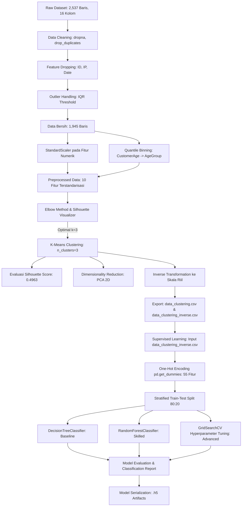

# Financial Transaction Profiling & Behavioral Classification Pipeline

[](https://www.python.org/)
[](https://scikit-learn.org/)
[](https://pandas.pydata.org/)
[](https://jupyter.org/)
[](https://github.com/G-than12/financial-fraud-detection)

> **End-to-End Machine Learning Workflow**: Segmentasi perilaku transaksi nasabah menggunakan *Unsupervised Learning* (K-Means Clustering & PCA) yang diintegrasikan dengan *Supervised Learning* (Klasifikasi Multi-Kelas berbasis Random Forest & Decision Tree) untuk prediksi segmen nasabah baru secara presisi dan *real-time*.

---

## 👤 Author Information
- **Author**: Gathan Hilabi
- **Track**: Machine Learning Engineering & Data Science
- **Repository URL**: [https://github.com/G-than12/financial-fraud-detection](https://github.com/G-than12/financial-fraud-detection)

---

## 📌 Catatan Teknis: Konteks Proyek & Penamaan Repositori

> [!IMPORTANT]
> **Klarifikasi Implementasi Aktual vs. Penamaan Repositori:**
> Meskipun repositori ini dinamai **`financial-fraud-detection`**, implementasi teknis aktual pada proyek ini berfokus pada **Segmentasi Transaksi & Profiling Perilaku Nasabah (*Customer Behavioral Profiling*)** menggunakan algoritma **K-Means Clustering**, yang kemudian dilanjutkan dengan tahap **Klasifikasi Multi-Kelas (*Supervised Learning*)** untuk memprediksi klaster nasabah (`Target: 0, 1, 2`).
>
> Proyek ini **tidak** melakukan klasifikasi biner transaksi (*Fraud* vs *Legitimate*), melainkan membangun pemodelan dasar (*baseline behavioral modeling*). Di industri perbankan dan *fintech* modern, pemahaman profil transaksi normal nasabah semacam ini merupakan prasyarat vital (*prerequisite*) sebelum mendesain sistem deteksi anomali atau aturan pencegahan fraud (*fraud rule-engine*).

---

## 📋 Table of Contents
1. [Project Overview](#-project-overview)
2. [Project Objectives](#-project-objectives)
3. [Dataset & Feature Architecture](#-dataset--feature-architecture)
4. [Machine Learning Pipeline](#-machine-learning-pipeline)
5. [Unsupervised Learning: K-Means Clustering](#-unsupervised-learning-k-means-clustering)
6. [Supervised Learning: Segment Classification](#-supervised-learning-segment-classification)
7. [Model Comparison & Benchmark Results](#-model-comparison--benchmark-results)
8. [Business Impact & Strategic Recommendations](#-business-impact--strategic-recommendations)
9. [Repository Structure & Model Artifacts](#-repository-structure--model-artifacts)
10. [Installation & Quick Start](#-installation--quick-start)
11. [Git Deployment Guide](#-git-deployment-guide)

---

## 🔍 Project Overview

Institusi finansial memproses jutaan transaksi setiap hari dengan karakteristik nasabah yang sangat heterogen—mulai dari pelajar/mahasiswa berpendapatan terbatas hingga profesional mapan dengan volume saldo tinggi. Pendekatan *one-size-fits-all* tidak lagi efektif dalam manajemen portofolio nasabah, mitigasi risiko kredit, maupun personalisasi penawaran produk.

Proyek ini menghadirkan solusi *machine learning end-to-end* yang memadukan kekuatan **Unsupervised Learning** dan **Supervised Learning**:
1. **Tahap Unsupervised**: Melakukan ekstraksi pola tersembunyi dari data histori transaksi nasabah menggunakan algoritma **K-Means Clustering**. Kualitas pemisahan klaster divalidasi menggunakan teknik *Elbow Method* dengan metrik *Silhouette Score* serta visualisasi 2D melalui reduksi dimensi **Principal Component Analysis (PCA)**. Seluruh data hasil klasterisasi kemudian di-*inverse transform* ke bentuk nilai riil untuk menghasilkan interpretasi profil bisnis yang terukur.
2. **Tahap Supervised**: Memanfaatkan label klaster (`Target: 0, 1, 2`) yang dihasilkan K-Means sebagai label kelas untuk melatih model klasifikasi (**Decision Tree Classifier** dan **Random Forest Classifier**). Model ini memungkinkan sistem mengkategorisasikan transaksi atau nasabah baru secara instan tanpa perlu menjalankan ulang proses *clustering* yang memakan komputasi besar.
3. **Hyperparameter Optimization**: Mengoptimalkan performa model klasifikasi melalui pencarian grid mendalam (**GridSearchCV**) dengan validasi silang 5-lipat (*5-fold stratified cross-validation*) guna menjamin generalisasi model pada data baru.

---

## 🎯 Project Objectives

- [x] **Pembersihan & Pra-Pemrosesan Data**: Mengeliminasi *missing values* (18–30 per fitur), membersihkan duplikasi baris (21 data duplikat), serta menghapus identifier berdimensi tinggi/temporal (*TransactionID*, *AccountID*, *Date*, *IP Address*).
- [x] **Deteksi & Penanganan Outlier**: Menapis pencilan data numerik menggunakan metode **Interquartile Range (IQR)** dengan batas $1.5 \times IQR$ untuk menghasilkan data bersih berukuran 1.945 baris.
- [x] **Feature Engineering & Scaling**: Mengimplementasikan *quantile-based binning* pada fitur umur (`CustomerAge`) menjadi 3 kategori (`AgeGroup`: Rendah, Sedang, Tinggi) dan standardisasi fitur numerik menggunakan `StandardScaler`.
- [x] **Pemodelan K-Means Clustering**: Menentukan jumlah klaster optimal ($k=3$) berbasis *Silhouette Score Elbow Visualizer* dan melatih model K-Means berkinerja tinggi (*Silhouette Score*: **0.4963**).
- [x] **Reduksi Dimensi & Visualisasi 2D**: Menerapkan algoritma **PCA (n_components=2)** untuk visualisasi sebaran klaster dan penentuan letak koordinat *centroid*.
- [x] **Inverse Transform & Interpretasi Bisnis**: Mengembalikan data hasil klasterisasi ke skala asli (rupiah/dolar dan kategori teks) untuk memetakan karakteristik statistik (mean, min, max, modus) tiap segmen nasabah.
- [x] **Pembangunan Model Klasifikasi Multi-Kelas**: Melatih *Decision Tree Classifier* (baseline) dan *Random Forest Classifier* (advanced ensemble).
- [x] **Hyperparameter Tuning via GridSearchCV**: Menemukan kombinasi parameter terbaik pada Random Forest (`n_estimators`, `max_depth`, `min_samples_split`) dengan 5-fold cross-validation.
- [x] **Evaluasi Komprehensif**: Mengevaluasi model menggunakan metrik *Accuracy*, *Precision*, *Recall*, dan *F1-Score* berbasis *confusion report*, mencapai akurasi uji hingga **98.97%**.
- [x] **Serialisasi & Penyimpanan Model**: Menyimpan seluruh artefak model ke dalam format HDF5/Joblib (`.h5`) yang siap untuk *deployment* inferensi.

---

## 📊 Dataset & Feature Architecture

Dataset mencatat aktivitas transaksi perbankan dan demografi nasabah. Dataset diproses melalui dua tahapan bentuk penyimpanan CSV:

| Metadata Atribut | Deskripsi / Nilai Riil |
| :--- | :--- |
| **Sumber Data** | Google Sheets Enterprise CSV Endpoint |
| **Ukuran Data Mentah** | 2.537 Baris $\times$ 16 Kolom |
| **Ukuran Data Bersih (Preprocessed)** | 1.945 Baris $\times$ 11 Kolom (Termasuk kolom `Target`) |
| **Target Prediksi (Kelas Supervised)** | `Target` (Nilai klaster: 0, 1, 2) |
| **Fitur Numerik** | 5 Fitur (`TransactionAmount`, `CustomerAge`, `TransactionDuration`, `LoginAttempts`, `AccountBalance`) |
| **Fitur Kategorikal** | 5 Fitur (`TransactionType`, `Location`, `Channel`, `CustomerOccupation`, `AgeGroup`) |
| **Fitur Hasil One-Hot Encoding** | 55 Fitur (Digunakan pada tahap klasifikasi) |

### Kamus Data (Feature Dictionary)

| Nama Fitur | Tipe Data | Kategori | Deskripsi Bisnis |
| :--- | :---: | :---: | :--- |
| **TransactionAmount** | Float | Numerik | Besaran nilai uang yang ditransaksikan dalam satu transaksi. |
| **CustomerAge** | Float | Numerik | Usia nasabah pemilik rekening (rentang: 18 – 80 tahun). |
| **TransactionDuration** | Float | Numerik | Durasi waktu penyelesaian sesi transaksi (satuan detik: 10 – 300 detik). |
| **LoginAttempts** | Float | Numerik | Jumlah percobaan login nasabah sebelum transaksi diproses (stabil di angka 1.0). |
| **AccountBalance** | Float | Numerik | Total saldo simpanan nasabah di rekening bank. |
| **TransactionType** | Object | Kategorikal | Metode otorisasi transaksi yang digunakan nasabah (`Debit` / `Credit`). |
| **Location** | Object | Kategorikal | Kota asal transaksi/nasabah (misal: *Charlotte*, *Tucson*, *Fort Worth*, dsb.). |
| **Channel** | Object | Kategorikal | Kanal layanan perbankan yang digunakan (`Branch`, `ATM`, `Online`). |
| **CustomerOccupation** | Object | Kategorikal | Profesi nasabah (`Student`, `Doctor`, `Engineer`, `Retired`). |
| **AgeGroup** | Object | Kategorikal | Fitur rekayasa hasil *quantile binning* umur nasabah (`Rendah`, `Sedang`, `Tinggi`). |
| **Target** | Integer | Label Kelas | Label klaster hasil Unsupervised K-Means (`0`, `1`, `2`). |

> *Catatan: Kolom `TransactionID`, `AccountID`, `PreviousTransactionDate`, `DeviceID`, `IP Address`, `MerchantID`, dan `TransactionDate` telah dieleminasi pada tahap data cleaning karena bertindak sebagai identifier ber-cardinalitas tinggi yang tidak memiliki signifikansi generalisasi statistik.*

---

## ⚙️ Machine Learning Pipeline

### Pipeline Flowchart



### Architectural Text Pipeline
```
[RAW DATA: 2,537 baris]
   │
   ├─► [CLEANING] dropna() ──► drop_duplicates() ──► drop(id, ip, date)
   │
   ├─► [OUTLIER TRIMMING] IQR Filtering (1.5x IQR) ──► Hasil: 1,945 baris
   │
   ├─► [TRANSFORM] StandardScaler(Numerik) + LabelEncoder + Binning(AgeGroup)
   │
   ├─► [UNSUPERVISED] K-Means (k=3, Silhouette=0.4963) + PCA 2D
   │        │
   │        └─► Inverse Transform ──► data_clustering_inverse.csv (Target: 0,1,2)
   │
   └─► [SUPERVISED] One-Hot Encoding (55 fitur) ──► Stratified Split (80:20)
            │
            ├─► Model 1: Decision Tree (Akurasi: 95.63%)
            ├─► Model 2: Random Forest (Akurasi: 98.71%)
            └─► Model 3: Tuned Random Forest GridSearchCV (Akurasi: 98.97%)
```

---

## 🔬 Unsupervised Learning: K-Means Clustering

### 1. Penentuan Jumlah Klaster Optimal ($k$)
Jumlah klaster ditentukan secara empiris menggunakan **KElbowVisualizer** dengan rentang $k \in [2, 9]$. Berdasarkan kurva *Silhouette Coefficient*, penurunan inersia paling efisien dan kohesi klaster terbaik diperoleh pada titik **$k = 3$**.

- **Algoritma**: K-Means (`n_clusters=3`, `random_state=42`)
- **Silhouette Score**: **0.49634** (~0.50), menandakan bahwa batas antar klaster terdefinisi dengan sangat baik dan minim resiko *overlap*.
- **Reduksi Dimensi**: PCA 2 Komponen (`PCA(n_components=2)`) digunakan untuk memetakan koordinat titik transaksi serta memvisualisasikan titik tengah (*centroid*) klaster pada bidang kartesius 2 dimensi.

### 2. Statistik Agregasi Data Hasil Inverse Transform

Data dikembalikan ke nilai riil menggunakan `scaler.inverse_transform` (fitur numerik) dan `encoder.inverse_transform` (fitur kategorikal).

#### Ringkasan Statistik Fitur Numerik (Mean, Min, Max)
| Fitur Numerik | Metrik | Cluster 0 (555 data) | Cluster 1 (690 data) | Cluster 2 (700 data) |
| :--- | :--- | :---: | :---: | :---: |
| **TransactionAmount** | Mean<br>Min<br>Max | **254.56**<br>0.32<br>903.19 | **258.21**<br>0.26<br>889.01 | **257.29**<br>0.45<br>890.24 |
| **CustomerAge** (Tahun) | Mean<br>Min<br>Max | **44.84**<br>18.00<br>80.00 | **43.85**<br>18.00<br>80.00 | **45.41**<br>18.00<br>80.00 |
| **TransactionDuration** (Detik) | Mean<br>Min<br>Max | **119.74**<br>10.00<br>300.00 | **117.31**<br>10.00<br>299.00 | **120.70**<br>10.00<br>299.00 |
| **LoginAttempts** (Kali) | Mean<br>Min<br>Max | **1.00**<br>1.00<br>1.00 | **1.00**<br>1.00<br>1.00 | **1.00**<br>1.00<br>1.00 |
| **AccountBalance** | Mean<br>Min<br>Max | **5,001.21**<br>117.98<br>14,935.50 | **5,109.80**<br>102.20<br>14,977.99 | **5,170.92**<br>112.76<br>14,942.78 |

#### Ringkasan Karakteristik Fitur Kategorikal (Modus)
| Fitur Kategorikal | Cluster 0 | Cluster 1 | Cluster 2 |
| :--- | :---: | :---: | :---: |
| **CustomerOccupation** | Student (Pelajar/Mahasiswa) | Student (Pelajar/Mahasiswa) | Engineer (Insinyur/Profesional) |
| **AgeGroup** | Rendah | Rendah | Sedang (Produktif Matang) |
| **TransactionType** | Debit | Debit | Debit |
| **Location** | Charlotte | Tucson | Fort Worth |
| **Channel** | Branch | Branch | Branch |

### 3. Profiling Karakteristik Segmen
1. **Cluster 0: Nasabah Transaksi Harian Standar (Low Balance Tier)**
   - Merepresentasikan segmen nasabah dengan saldo rata-rata terendah (**5.001,21**). Didominasi oleh profesi pelajar/mahasiswa (*Student*) dengan kelompok usia muda (*Rendah*). Pola transaksi cenderung harian melalui kartu debit di kantor cabang fisik.
2. **Cluster 1: Nasabah Muda Aktif & Transaksi Cepat (High Transaction Velocity)**
   - Rata-rata usia termuda (**43,85 tahun**) dengan nominal transaksi tertinggi (**258,21**) dan durasi penyelesaian transaksi paling singkat (**117,31 detik**). Menunjukkan segmen nasabah adaptif yang memiliki mobilitas tinggi dalam bertransaksi.
3. **Cluster 2: Nasabah Profesional Mapan (Affluent Tier)**
   - Segmen nasabah dengan akumulasi saldo tertinggi (**5.170,92**) dan usia paling matang (**45,41 tahun**). Didominasi oleh profesi insinyur (*Engineer*) dalam kelompok usia produktif menengah (*Sedang*). Merupakan segmen paling potensial untuk produk investasi dan wealth management.

---

## 🤖 Supervised Learning: Segment Classification

### Data Splitting & Feature Encoding
- **Input Data**: `data/data_clustering_inverse.csv`
- **Encoding**: `pd.get_dummies(..., drop_first=True)` menghasilkan **55 fitur**.
- **Proporsi Split**: 80% Data Latih (1.556 sampel) dan 20% Data Uji (389 sampel).
- **Stratifikasi**: `stratify=y` menjamin rasio kelas target pada data uji proporsional dengan data asli.

---

## 📈 Model Comparison & Benchmark Results

Evaluasi performa dilakukan pada data uji independen (*389 sampel*) menggunakan metrik standar industri:

### 1. Performa Decision Tree Classifier (Baseline)
- Parameter: `DecisionTreeClassifier(random_state=42)`
- Akurasi Keseluruhan: **95.63% (0.96)**

| Kelas Target | Precision | Recall | F1-Score | Support |
| :---: | :---: | :---: | :---: | :---: |
| **Cluster 0** | 0.91 | 0.95 | 0.93 | 111 |
| **Cluster 1** | 1.00 | 1.00 | 1.00 | 138 |
| **Cluster 2** | 0.96 | 0.92 | 0.94 | 140 |
| **Accuracy** | | | **0.96** | **389** |
| **Macro Avg** | **0.95** | **0.96** | **0.95** | 389 |
| **Weighted Avg** | **0.96** | **0.96** | **0.96** | 389 |

### 2. Performa Random Forest Classifier (Skilled Exploration)
- Parameter: `RandomForestClassifier(random_state=42)`
- Akurasi Keseluruhan: **98.71% (0.99)**

| Kelas Target | Precision | Recall | F1-Score | Support |
| :---: | :---: | :---: | :---: | :---: |
| **Cluster 0** | 1.00 | 0.95 | 0.98 | 111 |
| **Cluster 1** | 1.00 | 1.00 | 1.00 | 138 |
| **Cluster 2** | 0.97 | 1.00 | 0.98 | 140 |
| **Accuracy** | | | **0.99** | **389** |
| **Macro Avg** | **0.99** | **0.98** | **0.99** | 389 |
| **Weighted Avg** | **0.99** | **0.99** | **0.99** | 389 |

### 3. Performa Tuned Random Forest via GridSearchCV (Advanced)
- Metode Tuning: `GridSearchCV(cv=5, scoring='accuracy')`
- Parameter Grid yang Diuji:
  ```python
  params = {
      'n_estimators': [50, 100, 200],
      'max_depth': [None, 10, 20],
      'min_samples_split': [2, 5]
  }
  ```
- **Best Hyperparameters**: `{'max_depth': None, 'min_samples_split': 2, 'n_estimators': 50}`
- **Best CV Score**: **98.65%**
- **Akurasi Data Uji**: **98.97% (0.99)**

| Kelas Target | Precision | Recall | F1-Score | Support |
| :---: | :---: | :---: | :---: | :---: |
| **Cluster 0** | 1.00 | 0.95 | 0.98 | 111 |
| **Cluster 1** | 0.99 | 1.00 | 1.00 | 138 |
| **Cluster 2** | 0.97 | 1.00 | 0.99 | 140 |
| **Accuracy** | | | **0.99** | **389** |
| **Macro Avg** | **0.99** | **0.98** | **0.99** | 389 |
| **Weighted Avg** | **0.99** | **0.99** | **0.99** | 389 |

### Tabel Komparasi Model

| Model | Metodologi | Accuracy | Macro F1 | Weighted F1 | Ukuran Artefak | Status |
| :--- | :--- | :---: | :---: | :---: | :---: | :---: |
| **Decision Tree** | Baseline CART | 95.63% | 0.95 | 0.96 | ~16 KB | Terverifikasi |
| **Random Forest** | Ensemble Bagging | 98.71% | 0.99 | 0.99 | ~1.8 MB | Terverifikasi |
| **Tuned Random Forest** | GridSearchCV (5-Fold) | **98.97%** | **0.99** | **0.99** | ~914 KB | **Model Terbaik** |

---

## 💼 Business Impact & Strategic Recommendations

Implementasi pipeline ini memberikan nilai strategis langsung bagi operasional perbankan digital:

1. **Segment-Driven Product Offering**:
   - **Cluster 0 (Student/Low Balance)**: Program bebas biaya bulanan kartu debit, promo diskon merchant kuliner/pendidikan, serta edukasi fitur *mobile banking* untuk memindahkan antrean kantor cabang ke digital.
   - **Cluster 1 (High Velocity Shoppers)**: Program cashback transaksi cepat, integrasi *contactless debit/e-wallet*, dan fasilitas tabungan terencana otomatis (*auto-debit* tabungan impian).
   - **Cluster 2 (Affluent Professionals)**: Penawaran produk berimbal hasil tinggi seperti reksa dana pasar uang, obligasi ritel, deposito bunga premium, serta proteksi asuransi aset.
2. **Real-Time Automated Segmentation**:
   - Model klasifikasi yang telah dilatih mampu mengklasifikasikan nasabah baru secara *sub-millisecond* saat transaksi pertama kali terjadi, memungkinkan *personalized UI/UX* instan pada aplikasi mobile banking.
3. **Pondasi Deteksi Anomali / Fraud Screening**:
   - Dengan terpetakannya perilaku transaksi wajar tiap klaster (misal: Cluster 0 memiliki batas maksimum transaksi 903.19 dan durasi rata-rata 119.74 detik), setiap deviasi ekstrem yang melampaui distribusi batas klaster nasabah bersangkutan dapat ditandai sebagai indikator anomali (*risk scoring trigger*).

---

## 📂 Repository Structure & Model Artifacts

```
financial-fraud-detection/
├── data/
│   ├── data_clustering.csv                 # Dataset hasil clustering (skala terstandardisasi)
│   └── data_clustering_inverse.csv         # Dataset hasil clustering (skala riil + label teks)
│
├── models/
│   ├── model_clustering.h5                 # Model K-Means Clustering (n_clusters=3)
│   ├── PCA_model_clustering.h5             # Model K-Means hasil reduksi dimensi PCA 2D
│   ├── decision_tree_model.h5              # Model Decision Tree Classifier (Akurasi: 95.63%)
│   ├── explore_RandomForest_classification.h5 # Model Random Forest Classifier (Akurasi: 98.71%)
│   └── tuning_classification.h5            # Model Random Forest Tuned GridSearchCV (Akurasi: 98.97%)
│
├── notebooks/
│   ├── [Clustering]_Submission_Akhir_BMLP_GathanHilabi.ipynb   # Pipeline Clustering & Preprocessing
│   └── [Klasifikasi]_Submission_Akhir_BMLP_GathanHilabi.ipynb  # Pipeline Klasifikasi & Tuning
│
├── .gitignore                              # Git ignore configuration
├── requirements.txt                        # Daftar dependensi library Python
└── README.md                               # Dokumentasi teknis proyek
```

---

## 🚀 Installation & Quick Start

Untuk mereplikasi atau menguji pipeline ini di lingkungan lokal Anda, ikuti langkah-langkah berikut:

### 1. Kloning Repositori
```bash
git clone https://github.com/G-than12/financial-fraud-detection.git
cd financial-fraud-detection
```

### 2. Setup Virtual Environment
```bash
# Windows
python -m venv .venv
.venv\Scripts\activate

# Linux / MacOS
python3 -m venv .venv
source .venv/bin/activate
```

### 3. Instalasi Dependensi
```bash
pip install --upgrade pip
pip install pandas numpy scikit-learn matplotlib seaborn yellowbrick joblib jupyter
```

### 4. Menjalankan Jupyter Notebook
```bash
jupyter notebook
```
Buka folder `notebooks/` dan jalankan notebook secara berurutan:
1. `[Clustering]_Submission_Akhir_BMLP_GathanHilabi.ipynb`
2. `[Klasifikasi]_Submission_Akhir_BMLP_GathanHilabi.ipynb`

### 5. Memuat Model untuk Inferensi Cepat
```python
import joblib
import pandas as pd

# Load tuned classifier model
model = joblib.load('models/tuning_classification.h5')

# Contoh prediksi klaster nasabah baru
# (pastikan fitur X telah di-encode sesuai skema pd.get_dummies)
# y_pred = model.predict(X_new)
print("Model berhasil dimuat dan siap melakukan prediksi.")
```

---

## 📤 Git Deployment Guide

Gunakan urutan perintah CLI berikut untuk mengunggah proyek ini ke repositori GitHub:

```bash
# Inisialisasi git pada root project
git init

# Tambahkan README.md (dan file lainnya) ke staging area
git add README.md

# Lakukan commit pertama
git commit -m "first commit: add comprehensive documentation"

# Atur branch utama ke main
git branch -M main

# Tambahkan remote repository GitHub
git remote add origin https://github.com/G-than12/financial-fraud-detection.git

# Push ke repositori GitHub
git push -u origin main
```

> **Tips:** Jika ingin mengunggah seluruh folder data, models, dan notebooks, jalankan:
> ```bash
> git add .
> git commit -m "feat: complete end-to-end clustering and classification pipeline"
> git push origin main
> ```

---

## 📜 Lisensi & Atribusi

Proyek ini dikembangkan oleh **Gathan Hilabi** sebagai pemenuhan Proyek Akhir kelas *Membangun Proyek Machine Learning* (Dicoding Indonesia). Terbuka untuk keperluan studi akademis, portofolio rekrutmen, dan eksplorasi riset data science.
